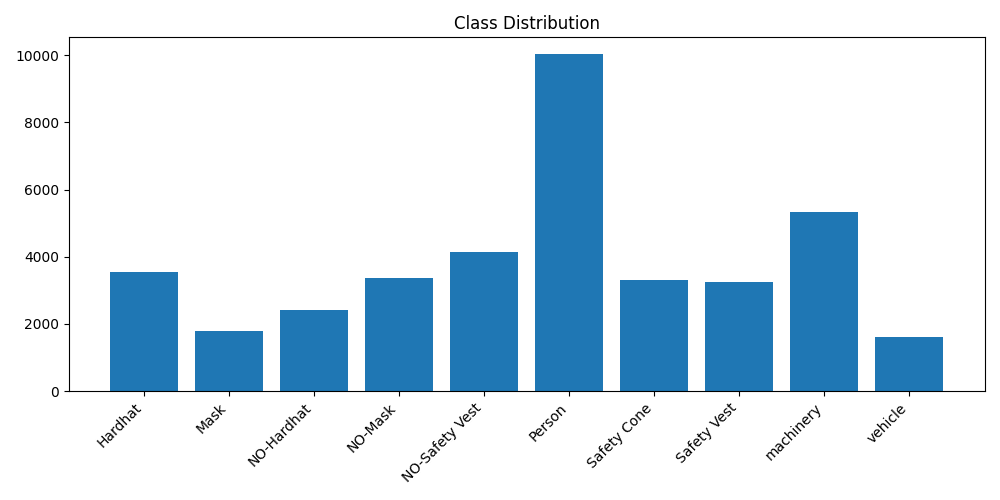
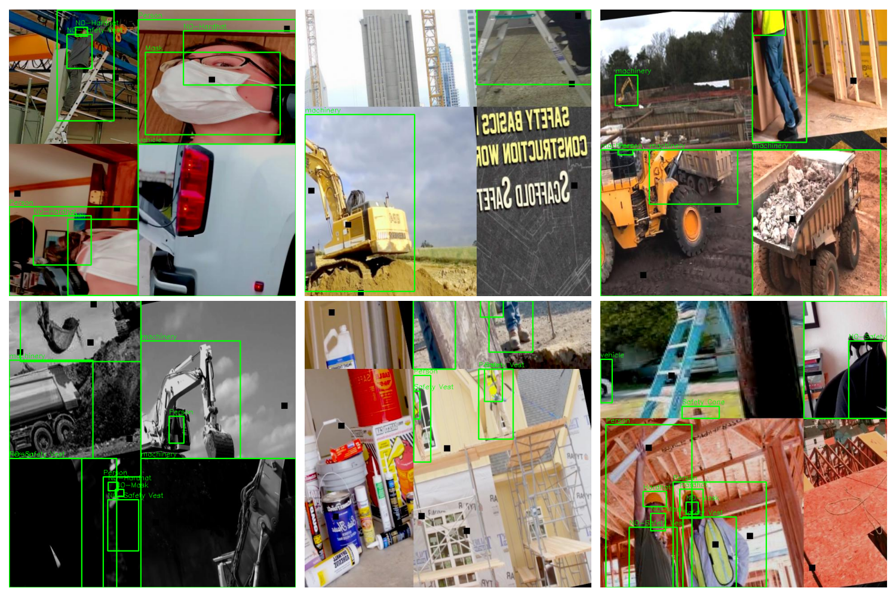

# PPE Compliance Agent

## Objective
An AI-powered system for detecting personal protective equipment (PPE) compliance violations in a chemical plant environment, using computer vision for detection and a multi-agent LLM system for automated triage, alerting, and compliance reporting.

## Status
Work in progress — bootcamp capstone project.

## Tech Stack
- YOLOv8 (Ultralytics) for PPE detection
- CrewAI + Anthropic Claude for agentic alerting
- Streamlit + Hugging Face Spaces for deployment
## Dataset & EDA

**Source:** Roboflow Universe — "Construction Site Safety" dataset (version 27)
**Size:** 2,801 images (train: 2,603 · valid: 114 · test: 82)
**Classes (10):** Hardhat, Mask, NO-Hardhat, NO-Mask, NO-Safety Vest, Person, Safety Cone, Safety Vest, machinery, vehicle

**Class distribution (instance counts):**

| Class | Count |
|---|---|
| Person | 10,031 |
| machinery | 5,337 |
| NO-Safety Vest | 4,153 |
| Hardhat | 3,551 |
| NO-Mask | 3,362 |
| Safety Cone | 3,306 |
| Safety Vest | 3,258 |
| NO-Hardhat | 2,428 |
| Mask | 1,792 |
| vehicle | 1,617 |

**Observations:**
- `Person` and `machinery` dominate as broad context classes, appearing frequently across nearly all images.
- Vest-related classes (Safety Vest vs. NO-Safety Vest) are reasonably balanced.
- Hardhat classes show mild imbalance, with compliant instances (Hardhat) outnumbering violations (NO-Hardhat) by roughly 1.5x.
- Mask classes are more skewed, with violations (NO-Mask) nearly double the compliant instances (Mask).
- `vehicle` and `Mask` are the smallest classes overall and are expected to show weaker detection performance due to fewer training examples.
- No `NO-Gloves` or `NO-Goggles` classes exist in this dataset; project scope is accordingly narrowed to **hardhat, mask, and safety vest** compliance.
**Class distribution:**

**Sample annotated images:**

## Model Training
- Base model: YOLOv8n (COCO-pretrained), fine-tuned on the PPE dataset
- Epochs: 40, image size: 640
- Results: mAP50 = 0.77, mAP50-95 = 0.46
- Tracked via Weights & Biases
## Multi-Agent Alerting System
Three-stage agentic pipeline for violation triage and alerting, implemented via direct LLM orchestration (Groq API, Llama 3.3 70B):
- **Triage Agent**: assesses violation severity against a defined safety policy
- **Routing & Notification Agent**: determines recipient and drafts a tailored alert message
- **Compliance Reporting Agent**: synthesizes batch violation data into trend summaries and recommendations

Note: CrewAI was evaluated for this pipeline but a framework-level compatibility bug with the Groq provider (a caching parameter incompatibility) led to implementing the same three-agent architecture via direct sequential LLM calls for reliability.